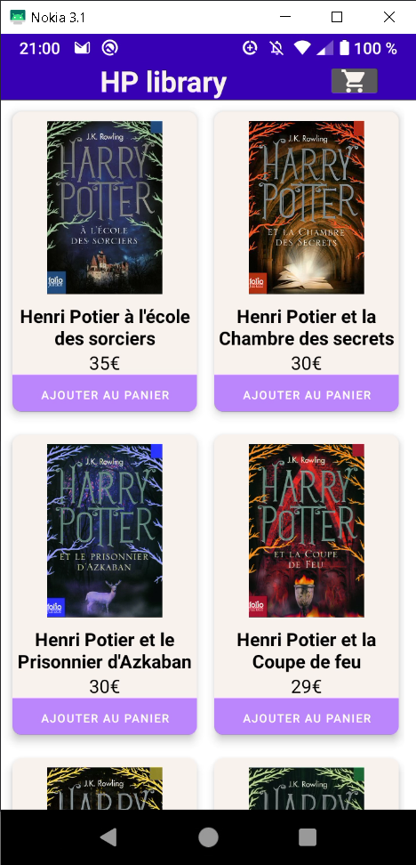
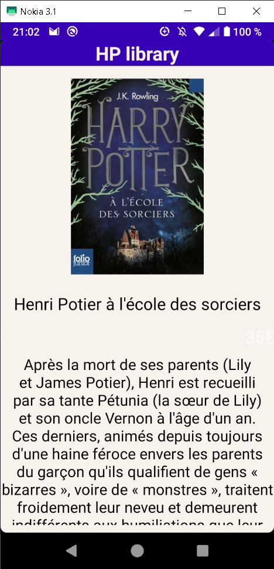
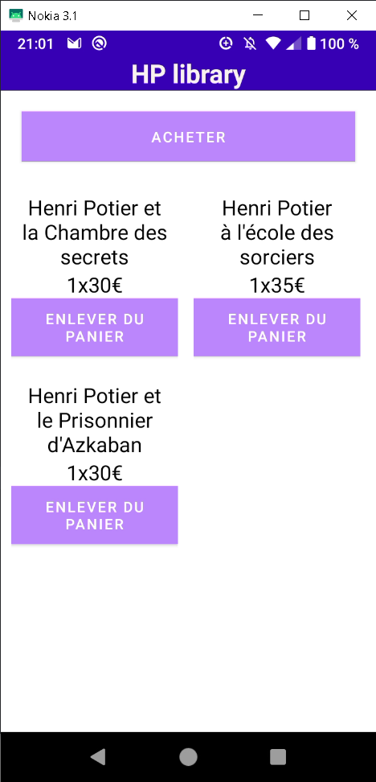

# andro-potter

Petit projet Androïd, réalisé en Kotlin pour apprendre les bases.

## Objectifs

Le but est de récupérer une liste de livres pour les afficher

## Résultats

Ce qui a été fait : 

- [ ] affichage d'une liste d'ouvrages (avec un affichage différent en Paysage)
- [ ] affichage du détails pour un item (avec un affichage différent en Paysage)
- [ ] affichage d'un panier rassemblant des items sélectionnés

### Illustrations

#### Bibliothèque

#### Les détails d'un ouvrage

#### Le panier

